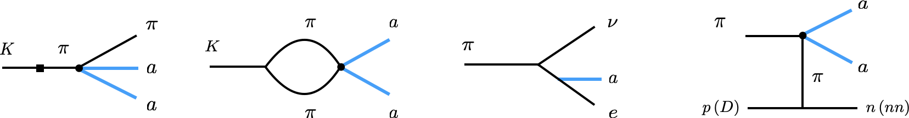

<!-- 

 -->
<!-- 
 -->
<!-- 
 -->
<!-- 
 -->

<h3>Welcome,</h3>
  

  I am a Neutrino Theory Network postdoctoral fellow at Harvard University working on particle phyics phenomenology.
  I was previously a postdoctoral researcher with a joint appointment at the Perimeter Institute in Canada and the University of Minnesota, and earned my Ph.D. in 2019 at the Institute for Particle Physics Phenomenology, part of Durham University, in the United Kingdom.
  

  

  In my research I want to expand our understanding of elementary particles called neutrinos and explore what they can teach us about physics beyond the Standard Model.
  I work closely with neutrino, dark matter, and accelerator experiments to devise new strategies in the search for new rare phenomena and new particles.
  Discoveries in this field would help us to make sense of the patterns we observe in fundamental interactions and particle masses, the origin of dark matter, and the cosmological evolution of our universe.
  

  

  In the Fall of 2025, I will start as an Assistant Professor at the University of Iowa, in Iowa City.
  The University has a strong research program in Physics and Astronomy and it's conveniently located within a three-hour drive of Fermilab, where several neutrino experiments are currently in operation.
  We have an opening for a postdoctoral position in neutrinos, dark matter, and beyond-the-Standard-Model physics with a start date of 2025.
  Interested candidates are encouraged to [apply here](https://inspirehep.net/jobs/2834239).
  

