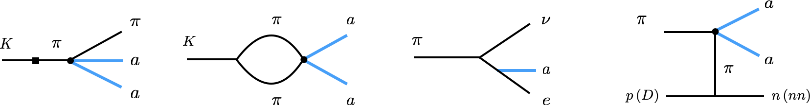

<!-- 

 -->
<!-- 
 -->
<!-- 
 -->
<!-- 
 -->

<h3>Welcome,</h3>

  

  I am an Assistant Professor at the University of Iowa, in Iowa City.

  My research focuses on theoretical and phenomenological aspects of neutrino, dark matter, and beyond-the-Standard Model physics.
  I like to devise new strategies in the search for new rare phenomena and new particles.

  Discoveries in this field would help us to make sense of the patterns we observe in fundamental interactions and particle masses, the origin of dark matter, and the cosmological evolution of our universe.
  

  <h3>Opportunities for Students</h3>
  

  Graduate and undergraduate students interested in particle physics phenomenology are encouraged to get in contact for research opportunities.
  

  

  Prospective students can find more details about the U. of Iowa Ph.D program <a href="https://physics.uiowa.edu/graduate/phd-physics">here</a>.
  

