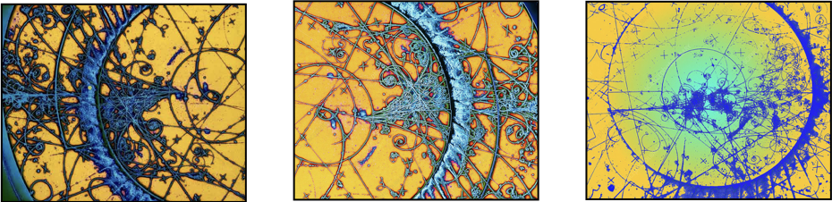

## Fall 2025: Particle Physics Beyond the Standard Model

PHYS:5905:0042 Special Topics in Physics: 
<a href="https://mhostert.github.io/files/teaching/PPBSM_syllabus_2025.pdf">Syllabus</a> / <a href="https://mhostert.github.io/files/teaching/Additional_resources_and_textbooks.pdf"> Additional reading</a>

**Introduction and overview:**

* [Natural units and waves](https://mhostert.github.io/files/teaching/notes_1_v2.pdf)
* [A crash course on the Standard Model](https://mhostert.github.io/files/teaching/notes_2_v3.pdf)
* [Spin, helicity, and neutrinos](https://mhostert.github.io/files/teaching/notes_3_v3.pdf)
* [A taste of perturbation theory and observables](https://mhostert.github.io/files/teaching/notes_4.pdf) 
* [Phase space and naive dimensional analysis](https://mhostert.github.io/files/teaching/phase_space_notes.pdf) 

**Neutrino physics:**
* [Neutrino oscillations](https://mhostert.github.io/files/teaching/notes_oscillations.pdf)
* [Neutrino oscillations beyond plane waves](https://mhostert.github.io/files/teaching/notes_oscillations_beyond_planewaves.pdf)
<!-- * Neutrino oscillations in matter and the MSW effect -->
<!-- * Detection of neutrino masses -->
<!-- * The seesaw mechanism  -->

<!-- **Dark matter:** -->
<!-- * Evidence for dark matter -->
<!-- * Thermal dark matter  -->

**Assignments:**

 * [The cosmic neutrino background](https://mhostert.github.io/files/teaching/Assingment_v2.pdf) ([discussion and solution](https://mhostert.github.io/files/teaching/solutions_and_discussions_1.pdf))
 * [Proton decay](https://mhostert.github.io/files/teaching/Assingment_2.pdf) ([discussion and solution](https://mhostert.github.io/files/teaching/solutions_and_discussions_2.pdf))
 * [Oscillations with non-Hermitian evolution](https://mhostert.github.io/files/teaching/Assignment_3.pdf) (discussion and solution)

{: width="60%" .align-center}

 
