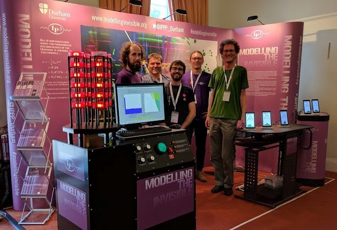
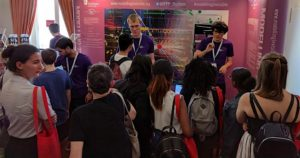
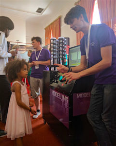
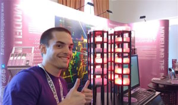

Modelling the invisible at the Royal Society
============================================

Student blog entry: 15th September 2017

By Matheus Hostert and Andres Olivares del Campo

This summer, for the first time, the Institute for Particle Physics Phenomenology ([IPPP](https://www.ippp.dur.ac.uk/)) had the chance to bring a few students and staff members to London for the [Royal Society Summer Exhibition.](https://royalsociety.org/science-events-and-lectures/) With a group of around 20 physicists, we set out to engage the public with an interactive exhibition that would represent part of the research carried out at our institute.

  
To the despair of our mechanical engineers, there is one thing we really like studying: the invisible. And by that we mean trying to understand and hunt for particles that have never been seen before. Therein lies the problem, how do we show what we do to the public? Well, our solution was to make our own particle physics experiment; modelling the invisible in an environment where we made up the rules of the game to demonstrate to the public what it is we get up to in the IPPP.

#### **The exhibition**

After 6 months of meetings, tweets, and the frustrating feeling that we had missed something important, the Summer Exhibition finally came to fruition, with over 14,000 people and 21 other exhibitions. We displayed a replica of a Dark Matter detector and our very own version of a [particle collider](https://home.cern/topics/large-hadron-collider).

Visitors had the chance to play with computer programmes to understand how we use simulations to look for new subatomic particles (for more on this, you can check [this blog entry](https://www.raspberrypi.org/blog/royal-society-galton-board/)). They could also have a go at finding Dark Matter with our detector. For us, it was a chance to share our enthusiasm for physics with public, whilst bonding with professors, postdocs and other students in a relaxed environment. Besides, it was a lesson on what science communication means for academics.

#### **Sci-Comm**

In the course of a week we learned why engaging with the general public about your research is a hugely beneficial thing to do as a scientist.

Picture this: A group of people are standing in front of you, maybe a family on an educational day out, or perhaps some tourists that accidentally stumbled upon your exhibition and are now stuck there, riddled with social awkwardness. Your job is to convince them, somehow, that Particle Physics is _so_ interesting that they should keep listening to you. Jargon will not help you here. In simple terms, you tell them about what you do, why, and perhaps even how you do it. Then one of the two things tends to happen: Either they nod vigorously, wish you good luck on your research and leave, or you see a furrowed brow and prepare for rapid-fire questions.

Imagine doing that for 15 different groups of people in one afternoon, with the occasional bonus of one-to-one chats with undercover experts. It can be pretty overwhelming, especially if it’s your first time doing something of this calibre.

#### Surprise yourself!

If you are anything like us, you’d be pretty surprised with yourself; surprised that what you said made sense, not only to the people you talked to, but also to yourself. You articulated your research in the simplest possible ways, and then your research took shape. Putting your work into a wider perspective is perhaps one of the most exciting parts of research, and we are convinced that it’s an essential experience to help keep yourself motivated throughout your postgraduate studies. So much so that we highly recommend you take part in science outreach yourself.

If you wanted to know more about the IPPP or want to get involved with other outreach activities in Durham click [here](https://web.archive.org/web/20220209093742/https://www.dur.ac.uk/science.outreach/).

